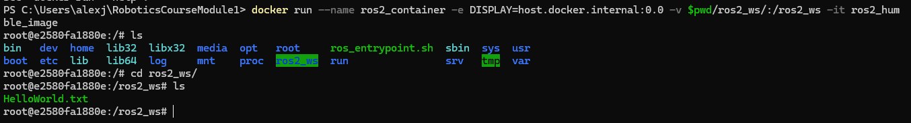
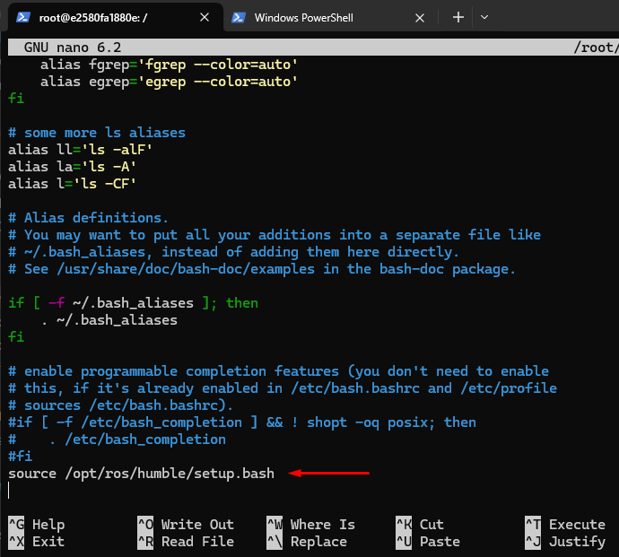
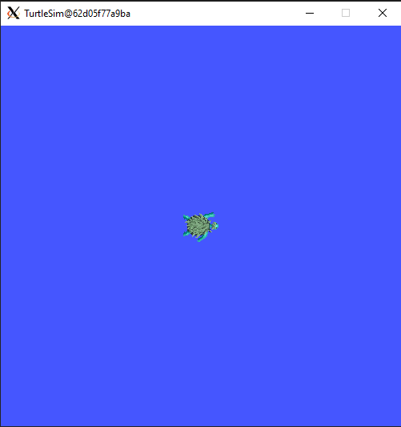
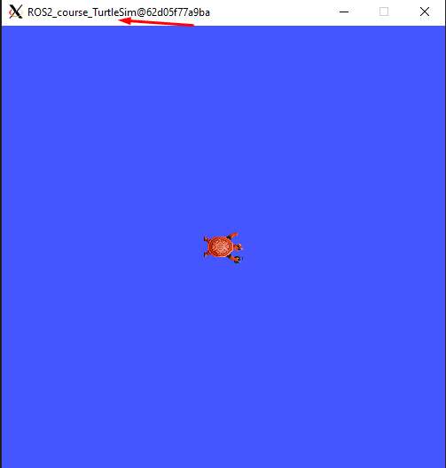
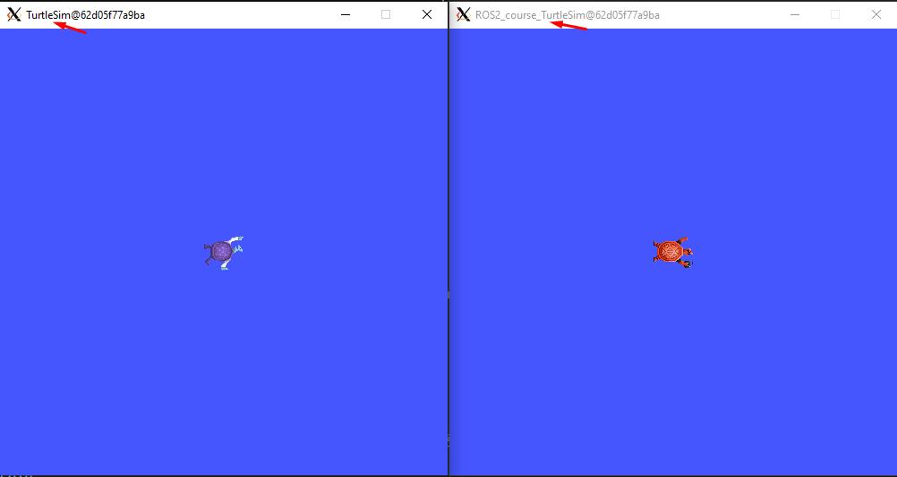

Configuring environment
=======================

.. _conf_env:

Any project that is developed in ROS 2, is typically called a "package". And all these packages are stored under a ROS workspace. See below, the folders structure that is followed when working with ROS 2. 

.. code-block:: console

   ROS_workspace_folder/
      src/
         cpp_package_1/
            CMakeLists.txt
            include/cpp_package_1/
            package.xml
            src/

         py_package_1/
            package.xml
            resource/py_package_1
            setup.cfg
            setup.py
            py_package_1/
         ...
         cpp_package_n/
            CMakeLists.txt
            include/cpp_package_n/
            package.xml
            src/

When initiating a Docker container from the ``ros2_humble_image`` that was generated in the `previous section`_, the folder called ``ros2_ws`` is the name of the ROS workspace that is going to be used for the course. 

.. _"previous section": https://alex-readthedocs-test.readthedocs.io/en/latest/Installation.html#generate-proper-docker-image

Below, it will be seen how to properly configure it as a workspace.

Creating and configuring the workspace
------------------

Open a Windows terminal, navigate to one folder above the directory where the folder to contain all the course progress is stored (the ``ros2_ws`` folder in this case) and execute:

.. code-block:: console

   docker run --name ros2_container -e DISPLAY=host.docker.internal:0.0 -v $pwd/ros2_ws/:/ros2_ws -it ros2_humble_image 

This command is mouniting a volume into the generated container. Inside the container, execute:

.. code-block:: console

   ls
   cd ros2_ws
   ls

See that the folder, at this point only contains a ``HelloWorld.txt`` file because of the linking of this folder with git; Recall this previous section.

.. _"this previous section": https://alex-readthedocs-test.readthedocs.io/en/latest/Installation.html#code-setup-for-working-with-docker

Inside this workspace folder create a ``src`` folder. In the ``ros2_ws/src`` directory, run the following command:

.. code-block:: console
   
   git clone https://github.com/ros/ros_tutorials.git -b humble

This command is clonning a github repository called: ``ros_tutorials``. This repository consists on various packages, among them, the ``turtlesim`` package, which will be the only one to be built for this example; See that the other packages in this repository contain a ``COLCON_IGNORE`` file. 

This is the current structure of the workspace. Notice that it does not exactly match the one shown above, but since the other packages (ros_tutorials, roscpp_tutorials and rospy_tutorials) are not going to be built, then it is like having only the ``turtlesim`` package and it can now be more similar to the workspace folders structure shown above.

.. code-block:: console

   ROS_workspace_folder/
      src/
         ros_tutorials/ 

            ros_tutorials/
               ...
               COLCON_IGNORE

            roscpp_tutorials/  
               ...
               COLCON_IGNORE

            rospy_tutorials/ 
               ...
               COLCON_IGNORE

            turtlesim/
               CHANGELOG.rst  
               CMakeLists.txt  
               action/  
               images/  
               include/  
               launch/  
               msg/  
               package.xml  
               src/  
               srv/  
               tutorials/

At this point the workspace has been populated with a sample package, but it is not a fully-functional workspace yet. 

Next, build this workspace by navigating to the ``ros2_ws`` folder and executing:

.. code-block:: console
 
   colcon build

The result will be similar to:

.. code-block:: console
 
   Starting >>> turtlesim
   [Processing: turtlesim]
   [Processing: turtlesim]
   Finished <<< turtlesim [1min 20s]

   Summary: 1 package finished [1min 21s]

Now execute ``ls`` and see the new folders that were generated as a result of building the workspace.

.. code-block:: console
 
   build  install  log  

At this point, the workspace is created and successfully built. 

Workspace sourcing 
------------------

It is important to define two concepts: "underlay" and "overlay". These refer to different workspaces that contain ROS packages and are used to build and run ROS-based applications.

- Underlay: The underlay workspace typically contains the core ROS packages and libraries, such as those provided by ROS distributions. It serves as the foundation for a ROS environment and provides the fundamental functionality and dependencies required for ROS to work.

- Overlay: An overlay workspace, on the other hand, contains additional ROS packages that were created or obtained from external sources. These packages extend the functionality of the ROS system beyond what's provided by the underlay workspace. To develop own ROS nodes, integrate third-party packages, or customize existing ROS packages overlay workspaces might be used.

Now, in order to set up the ROS 2 environment variables and its core functionalities it must be sourced the underlay ROS 2 workspace. This is achieved by executing:

.. code-block:: console
 
   source /opt/ros/humble/setup.bash

This command should be executed inside a Docker container terminal. Each time a new terminal is opened it would be necessary to setup the ROS 2 environment by executing the above command. 

In general, it's good practice to add the sourcing of the setup file to the ``.bashrc`` to ensure that the ROS 2 environment is always properly set up whenever a new terminal session is opened. This is exactly what has been done in the ``ros2_humble_image`` Docker image. Execute the following command in the Docker container terminal:

.. code-block:: console

   nano ~/.bashrc

Navigate to the end of the file with the keyboard arrows and check to find something similar to this:

Until now, it can be seen that the Docker container generated from ``ros2_humble_image`` Docker image, is correctly configured to source the underlay ROS 2 workspace. Next, it is time to see how the overlay workspace works.

`Open a new terminal`_ and execute either of these commands:

.. _Open a new terminal: https://alex-readthedocs-test.readthedocs.io/en/latest/Installation.html#opening-a-new-terminal

.. code-block:: console

   source install/local_setup.bash
   source install/setup.bash

Sourcing the ``local_setup`` of the overlay will only add the packages available in the overlay workspace to the current ROS 2 environment. 

On the other hand, ``setup`` sources the overlay as well as the underlay it was created in, allowing to utilize both workspaces. But, the overlay takes precedence over the contents of the underlay. 

Now, the ``turtlesim`` package from the overlay workspace can be executed:

.. code-block:: console

   ros2 run turtlesim turtlesim_node

This will open an Xlaunch window with a turtle in it, like this:

Now, it is important to mention that the ``turtlesim`` package also comes with the ROS 2 main installation, then how to tell which package is being executed? the one from the main installation (underlay workspace) or the one from the package that was just cloned into the workspace (overlay)? To answer this question, some modifications will be done in the ``ros2_ws/src/ros_tutorials/turtlesim`` package. 

Locate the ``turtle_frame.cpp`` file in ``<path_to_ws_folder>/ros2_ws/src/ros_tutorials/turtlesim/src``. Open ``turtle_frame.cpp`` with the preferred text editor (for this course, the suggested text editor is VScode).

On line 52 find the function ``setWindowTitle("TurtleSim")``, change the value "TurtleSim" to ``setWindowTitle("ROS2_course_TurtleSim")``, and save the file.

Return to the terminal where the ``ros2 run turtlesim turtlesim_node`` command was executed, stop it by pressing Ctrl+C, and run build the package again with:

.. code-block:: console

   colcon build

Source the overlay by executing:

.. code-block:: console

   source install/setup.bash

And run the turtlesim node again with:

.. code-block:: console

   ros2 run turtlesim turtlesim_node

An Xlaunch window should be opened with a turtle in it and the modified frame name to ``ROS2_course_TurtleSim``.

To see that your underlay is still intact, open a `brand a new terminal`_ and run turtlesim again:

.. _brand new terminal: https://alex-readthedocs-test.readthedocs.io/en/latest/Installation.html#opening-a-new-terminal

.. code-block:: console

   ros2 run turtlesim turtlesim_node

The result should be a new Xlaunch window with a different frame name, the ``TurtleSim`` name; having in total two Xlaunch windows. See picture below. 

Creating and configuring a package
------------------

Packages are the basic unit of software organization within ROS 2 architecture. These are directories containing software libraries, executables, scripts, configuration files, and other resources that provide specific functionality. 

In ROS 2, packages can be created with either CMake or Python, which are officially supported, though other build types do exist.

When building a package with CMake, the minimum required contents are:

.. code-block:: console

   my_package/
      CMakeLists.txt
      include/my_package/
      package.xml
      src/

Where:

- ``CMakeLists.txt`` file specifies the build instructions for the package, including compiler options, dependencies, targets to build, and installation rules.

- ``include/<package_name>`` directory contains the header files (.hpp) for the C++ classes and libraries provided by the package.
Header files define the interfaces and APIs exposed by the package, allowing other packages to use its functionality.

- ``package.xml`` provides metadata and information about the package.

- ``src`` directory containing the source code for the package.

When building a package with Python, the minimum required contents are:

.. code-block:: console

   my_package/
      package.xml
      resource/my_package
      setup.cfg
      setup.py
      my_package/

Where:

- ``package.xml``. Same as in the CMake-built package, it provides metadata and information about the package.

- ``resource/my_package`` directory typically contains additional resources or data files that are needed by the Python package.These resources might include configuration files, launch files, images, meshes, or any other files required by your package at runtime.

- ``setup.cfg`` file is a configuration file for setuptools, a library used to package Python projects. It contains various configuration options for how your Python package should be built, installed, and distributed.

- ``setup.py`` setup script for the Python package, responsible for configuring the package build, installation, and distribution process. It typically imports setuptools and calls its setup function with various arguments to define the package metadata and behavior.

- ``my_package/`` directory contains the Python source code (.py) files for the package.

Create a package with python 
~~~~~~~~~~~~~~~~

Now, the structure to create a new package with python is the following: 

.. code-block:: console

   ros2 pkg create --build-type ament_python --license Apache-2.0 <package_name>

To see an example of this, open a `brand a new terminal`_ in a Docker container, and  make sure no other ROS command is currently running. Navigate to ``ros2_ws/src`` and execute:

.. code-block:: console

   ros2 pkg create --build-type ament_python --license Apache-2.0 --node-name my_node my_package

Notice, that here, the ``--node-name my_node`` is new to the package creation structure that was shown above. This indicates to generate an executable node (``my_node``) inside the pacakge of name ``my_package``.

As a result, in the terminal it will be displayed some information about the package creation. 

.. code-block:: console

   going to create a new package
   package name: my_package
   destination directory: /ros2_ws/src
   package format: 3
   version: 0.0.0
   description: TODO: Package description
   maintainer: ['root <root@todo.todo>']
   licenses: ['Apache-2.0']
   build type: ament_python
   dependencies: []
   node_name: my_node
   creating folder ./my_package
   creating ./my_package/package.xml
   creating source folder
   creating folder ./my_package/my_package
   creating ./my_package/setup.py
   creating ./my_package/setup.cfg
   creating folder ./my_package/resource
   creating ./my_package/resource/my_package
   creating ./my_package/my_package/__init__.py
   creating folder ./my_package/test
   creating ./my_package/test/test_copyright.py
   creating ./my_package/test/test_flake8.py
   creating ./my_package/test/test_pep257.py
   creating ./my_package/my_package/my_node.py

Next, build the package by navigating to the ``ros2_ws`` workspace and executingw either of these commands:

.. code-block:: console

   colcon build
   colcon build --packages-select my_package

The second colcon build command builds only the specified package while the first one builds all the packages that are in the workspace. 

Source the workspace:

.. code-block:: console

   source install/setup.bash

And run the executable that was created using the ``--node-name <argument>`` during package creation, enter the command:

.. code-block:: console

   ros2 run my_package my_node

This should be the result in the terminal:

.. code-block:: console
   
   Hi from my_package.

Create a package with CMake 
~~~~~~~~~~~~~~~~

The structure to create a new package with CMake is the following: 

.. code-block:: console

   ros2 pkg create --build-type ament_cmake --license Apache-2.0 <package_name>

To see an example of this, open a `brand a new terminal`_ in a Docker container, and  make sure no other ROS command is currently running. Navigate to ``ros2_ws/src`` and execute:

.. code-block:: console

   ros2 pkg create --build-type ament_cmake --license Apache-2.0 --node-name my_node my_package_cpp

As a result, in the terminal it will be displayed some information about the package creation. 

.. code-block:: console

   going to create a new package
   package name: my_package_cpp
   destination directory: /ros2_ws/src
   package format: 3
   version: 0.0.0
   description: TODO: Package description
   maintainer: ['root <root@todo.todo>']
   licenses: ['Apache-2.0']
   build type: ament_cmake
   dependencies: []
   node_name: my_node
   creating folder ./my_package_cpp
   creating ./my_package_cpp/package.xml
   creating source and include folder
   creating folder ./my_package_cpp/src
   creating folder ./my_package_cpp/include/my_package_cpp
   creating ./my_package_cpp/CMakeLists.txt
   creating ./my_package_cpp/src/my_node.cpp

Next, build the package by navigating to the ``ros2_ws`` workspace and executing either of these commands:

.. code-block:: console

   colcon build
   colcon build --packages-select my_package_cpp

Source the workspace:

.. code-block:: console

   source install/setup.bash

And run the executable that was created using the ``--node-name <argument>`` during package creation, enter the command:

.. code-block:: console

   ros2 run my_package_cpp my_node

This should be the result in the terminal:

.. code-block:: console
   
   hello world my_package_cpp package

