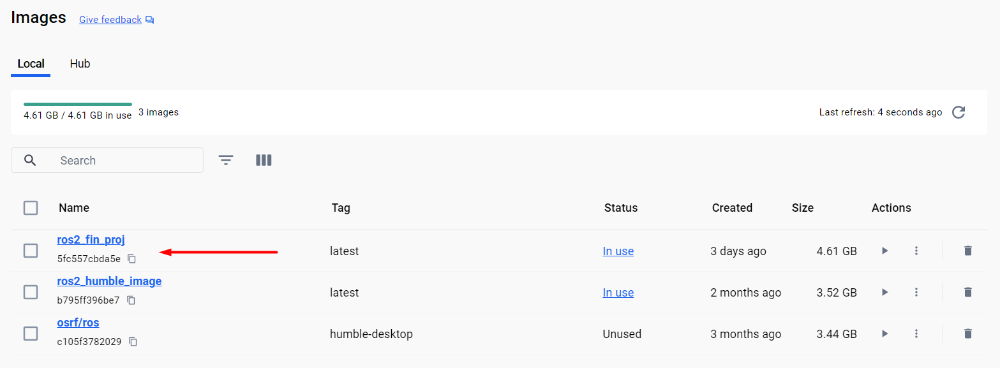

Final project
=====

.. _final_project:

Setting up 
------------

To work in the final project it will be necessary to install packages to the current ROS 2 environment. 

As it is known, when working with Docker, the changes performed in a container during a session, aren’t automatically preserved within the container once the session ends; unless, of course, a new session is created pointing to the exact same container. This is why a new Docker file, with the required packages installed on it, is to be generated. 

Recall from `this section of the course`_ that the Docker file was used for generating a Docker image from which later, a Docker container will be created which is finally where the ROS 2 final project development is going to be held. 

.. _this section of the course: https://alex-readthedocs-test.readthedocs.io/en/latest/Configuring%20environment.html#the-dockerfile-script-explained

Having stated the reason for creating a new Docker image, navigate to the ``Dockerfile`` file that was created at the beginning of the course and add the following to it.

.. code-block:: console

   RUN sudo apt-get update
   RUN sudo apt install ros-humble-gazebo-* -y
   RUN sudo apt install ros-humble-cartographer -y
   RUN sudo apt install ros-humble-cartographer-ros -y
   RUN sudo apt install ros-humble-navigation2 -y
   RUN sudo apt install ros-humble-nav2-bringup -y
   RUN bash -c "source ~/.bashrc"
   RUN sudo apt install ros-humble-dynamixel-sdk -y
   RUN sudo apt install ros-humble-turtlebot3-msgs -y
   RUN sudo apt install ros-humble-turtlebot3 -y

The complete ``Dockerfile`` should look like this:

.. code-block:: console

   FROM osrf/ros:humble-desktop

   RUN apt-get update && apt-get install -y nano && apt-get install tree 
   RUN apt install -y python3-pip
   RUN apt-get install dos2unix
   RUN pip3 install setuptools==58.2.0
   RUN echo "source /opt/ros/humble/setup.bash" >> ~/.bashrc

   RUN sudo apt-get update
   RUN sudo apt install ros-humble-gazebo-* -y
   RUN sudo apt install ros-humble-cartographer -y
   RUN sudo apt install ros-humble-cartographer-ros -y
   RUN sudo apt install ros-humble-navigation2 -y
   RUN sudo apt install ros-humble-nav2-bringup -y
   RUN bash -c "source ~/.bashrc"
   RUN sudo apt install ros-humble-dynamixel-sdk -y
   RUN sudo apt install ros-humble-turtlebot3-msgs -y
   RUN sudo apt install ros-humble-turtlebot3 -y

Once the ``Dockerfile`` is modified, let's generate a Docker image out of it. Go to the Windows terminal and navigate to the folder that contains the ``Dockerfile`` file and execute:

.. code-block:: console

   docker image build -t ros2_fin_proj .

This command will create a Docker image based on the ``Dockerfile`` with the name of ``ros2_fin_proj``.

Next, this Docker image will be the base for creating a Docker container which the final project programming will be carried on in. To create a container from this Docker image, follow the instruction on `this section`_  of the course, but running the container with this different command:

.. _`this section`: https://alex-readthedocs-test.readthedocs.io/en/latest/Installation%20and%20software%20setup.html#running-a-docker-container

.. code-block:: console

   docker run --name fin_proj_container -e DISPLAY=host.docker.internal:0.0 -v $pwd/ros2_ws/:/ros2_ws -it ros2_fin_proj

