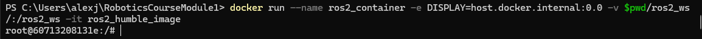
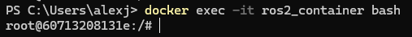

Installation
=====

.. _installation:

Installation
------------

Bla bla talk about the installation of Docker and the way it should work with ROS2. 

Running a docker container
--------------------------

In order to use GUI applications from within the container that will be created, first, if not perfomed yet, run the Xlaunch application and set the Display number to zero. 

.. image:: images/XlaunchSetDisplayToZero.png
   :alt: Setting display number to zero in Xlaunch.

Make sure that in the Docker desktop GUI window, there are no containers running.

.. image:: images/NoContainersRunning.png
   :alt: No containers are running in docker.

Open a terminal in Windows, navigate to the directory where the ROS2 workspace is stored, and execute the docker command to start running a container based on a specified docker image. This is the structure of such docker command:

.. code-block:: console

   docker run --name <container_name> -e DISPLAY=host.docker.internal:0.0 -v $pwd/<workspace_name>/:/<workspace_name> -it <image_name>

- ``--name`` argument is used to specify a custom name for the container that will be created. Hence, it is accompanied by ``<container_name>``.
- ``-e`` argument sets an environment variable within the container. In this case, it's setting the ``DISPLAY`` environment variable to ``host.docker.internal:0.0``. This is commonly used when it is desired to display GUI applications from within a Docker container.
- ``-v``argument mounts a volume inside the container. It allows mapping a directory on the host system (Windows OS system) to a directory inside the container. In this case, ``$pwd/<workspace_name>`` represents the current working directory followed by a directory named ``<workspace_name>`` on the host system, and ``/<workspace_name>`` represents the same directory inside the container.
- ``-it`` argument combines two flags, ``-i`` and ``-t``, which respectively stand for interactive mode and allocate a pseudo-TTY. This allows interacting with the container's command-line interface.

An example of this docker command execution:

.. code-block:: console

   docker run --name ros2_container -e DISPLAY=host.docker.internal:0.0 -v $pwd/ros2_ws/:/ros2_ws -it ros2_humble_image

Opening a new terminal
----------------------

When opening a new terminal in Windows, it will be necessary to link that terminal with the already running docker container. Perform the following to achieve this.

See the example below:

See that ``ros2_container`` is the name of the docker container that the current terminal is to be linked with.

Afterwards, if working with custom packages, i.e packages that were created during the course or imported from a third party repository, it will be necessary to source the appropriate setup file. Navigate to the workspace directory and execute:

.. code-block:: console
   
   source install/setup.bash

See the example below:

