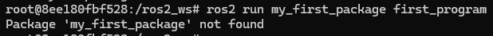
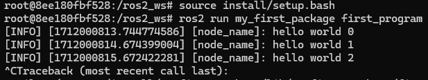
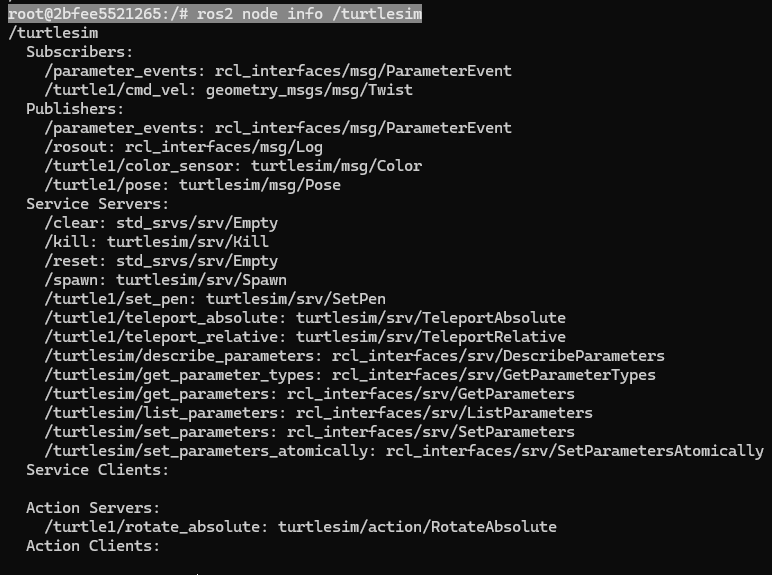
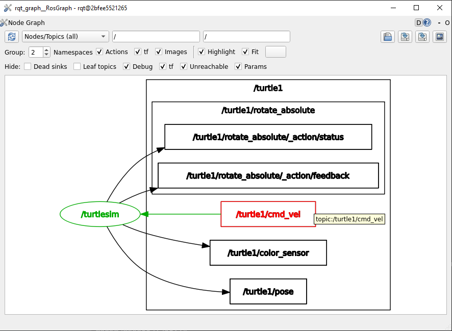

Nodes
=====

.. _installation:

What is it?
------------

- A node is a process that performs computation, communicates with other nodes, or both. 
- Typically responsible for specific tasks within a robotic system, such as controlling motors, processing sensor data, or implementing algorithms.
- Each node can send and receive data from other nodes via topics, services, actions, or parameters.
- Nodes play a crucial role in ROS2 applications, facilitating communication, computation, and modularity within robotic systems.

.. image:: https://docs.ros.org/en/humble/_images/Nodes-TopicandService.gif
   :alt: The way nodes communicate through services and topics.

Do not forget 
-------------
Remember to have your environment properly setup. Perform the following, if the ROS2 package cannot be found when executing it:

.. code-block:: console

   source install/setup.sh

See this example: 

- Look at the error of not being able to find the desired package. This is because the workspace was not configured correctly.

- Source the appropriate setup script to correctly configure the environment.

Notice that the sourcing is performed inside the workspace folder. 

Important commands 
------------------
The following can be executed with a node:

Running a node
~~~~~~~~~~~~~~

In order to run a node, perform:

.. code-block:: console

   ros2 run <package_name> <executable_name>

This command launches an executable script from a package. See this example:

.. code-block:: console

   ros2 run turtlesim turtlesim_node

Where, ``turtlesim`` is the name of the package and ``turtlesim_node``, is the name of the executable; This last, will tipycally coincide with the node name. 

Getting info from a node
~~~~~~~~~~~~~~~~~~~~~~~~

To print the information of a node, *open a new terminal* :ref:`Installation`/Opening a new terminal and execute:

.. code-block:: console

   ros2 node info <node_name>

See this example:

.. code-block:: console

   ros2 node info turtlesim_node

It displays the information about:

- The topics that this node is subscribed to. 
- The topics, this node is publishing to. 
- The service servers associated with this node. 
- The service clients associated with this node. 
- The action servers associated with this node. 
- The action clients associated with this node. 

Listing all nodes
~~~~~~~~~~~~~~~~~

To list all available nodes, execute:

.. code-block:: console

   ros2 node list

As an example, open a new terminal and execute:

.. code-block:: console

   ros2 run turtlesim turtle_teleop_key

Afterwards, execute ros2 n

It displays a list of all nodes that are currently running.

- The topics that this node is subscribed to. 
- The topics, this node is publishing to. 
- The service servers associated with this node. 
- The service clients associated with this node. 
- The action servers associated with this node. 
- The action clients associated with this node. 

