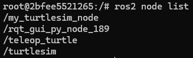
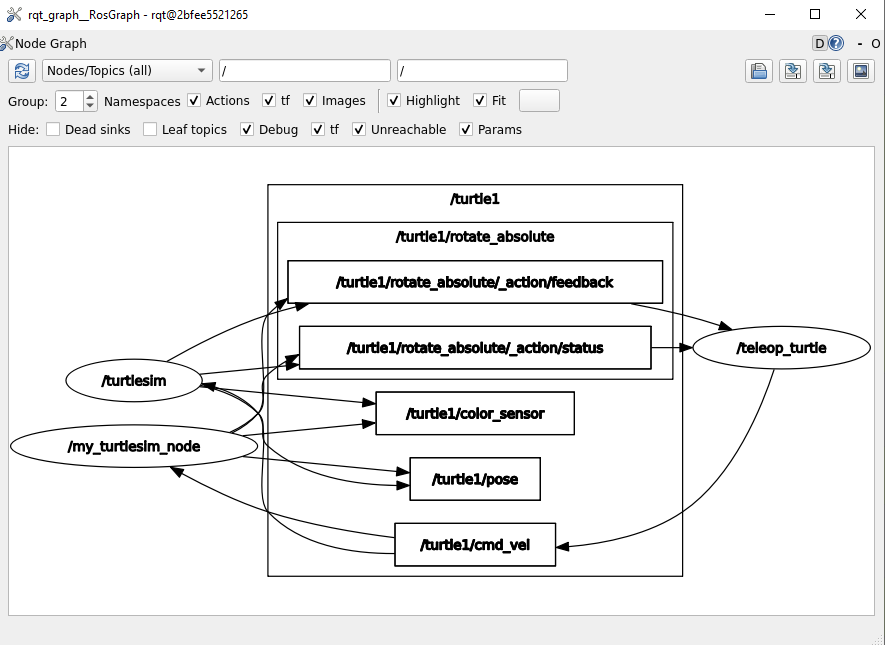

Nodes
=====

.. _nodes:

What is it?
------------

- A node is a process that performs computation, communicates with other nodes, or both. 
- Typically responsible for specific tasks within a robotic system, such as controlling motors, processing sensor data, or implementing algorithms.
- Each node can send and receive data from other nodes via topics, services, actions, or parameters.
- Nodes play a crucial role in ROS2 applications, facilitating communication, computation, and modularity within robotic systems.

.. image:: https://docs.ros.org/en/humble/_images/Nodes-TopicandService.gif
   :alt: The way nodes communicate through services and topics.

Do not forget 
-------------
Remember to have your environment properly setup. Perform the following, if the ROS2 package cannot be found when executing it:

.. code-block:: console

   source install/setup.sh

See this example: 

- Look at the error of not being able to find the desired package. This is because the workspace was not configured correctly.

.. image:: images/ErrorNotSourcing.png
   :alt: Error message of not sourcing workspace correctly.

- Source the appropriate setup script, that is, run ``source install/setup.sh``, to correctly configure the environment.

Notice that the sourcing is performed inside the workspace folder. 

Important commands. Nodes
-------------------------
Make sure to be in a brand new terminal window and no ROS commands are currently running. 

The following can be executed with a node:

1. Running a node
~~~~~~~~~~~~~~~~~

In order to run a node, perform:

.. code-block:: console

   ros2 run <package_name> <executable_name>

This command launches an executable script from a package. See this example:

.. code-block:: console

   ros2 run turtlesim turtlesim_node

Where, ``turtlesim`` is the name of the package and ``turtlesim_node``, is the name of the executable; This last, will tipycally coincide with the node name. 

2. Getting info from a node
~~~~~~~~~~~~~~~~~~~~~~~~~~~

To print the information of a node, `open a new terminal`_ and execute:

.. _open a new terminal: https://alex-readthedocs-test.readthedocs.io/en/latest/Installation.html#opening-a-new-terminal

.. code-block:: console

   ros2 node info <node_name>

See this example:

.. code-block:: console

   ros2 node info turtlesim_node

It displays the information about:

- The topics that this node is subscribed to. 
- The topics, this node is publishing to. 
- The service servers associated with this node. 
- The service clients associated with this node. 
- The action servers associated with this node. 
- The action clients associated with this node. 

.. image:: images/rosNodeInfo.png
   :alt: Executing ROS2 node info.

3. Listing all nodes
~~~~~~~~~~~~~~~~~~~~

To list all available nodes, :ref:`open a new terminal<_installation/Opening a new terminal>` and execute:

.. code-block:: console

   ros2 node list

As an example, :ref:`open a new terminal<Installation/Opening a new terminal>` and execute:

.. code-block:: console

   ros2 run turtlesim turtle_teleop_key

Afterwards, return to the terminal where it was ran ``ros2 node list`` and run it again. Two active nodes will be listed:

.. code-block:: console

   /turtlesim
   /teleop_turtle

4. Remapping nodes 
~~~~~~~~~~~~~~~~~~

In order to reassign default node properties, like node name, topic names, service names, etc., to custom values, the following command is used. Check its structure.

.. code-block:: console

   ros2 run <package_name> <executable_name> --ros-args --remap __node:=<new_node_name>

As an example, recall that two nodes already exist from the previous parts of this tutorial (the turtlesim and teleop_turtle nodes). :ref:`open a new terminal<installation/Opening a new terminal>` and execute:

.. code-block:: console

   ros2 run turtlesim turtlesim_node --ros-args --remap __node:=my_turtlesim_node

It reassigns the ``turtlesim_node`` node properties into a new node with custom name value of: "my_turtlesim_node".

Check in another terminal, the list of nodes and see also the rqt graph for this example.

ROS arguments are important when executing a node. The way ROS arguments are modified, is by using ``--ros-args`` in the execution command. After that, ``--remap`` and ``__node`` are used to specify that the node name should be remapped to "my_turtlesim_node". 

It is possible as well to modify the namespace, topic/service names and parameters of a node. See this link for more information: https://docs.ros.org/en/rolling/How-To-Guides/Node-arguments.html

